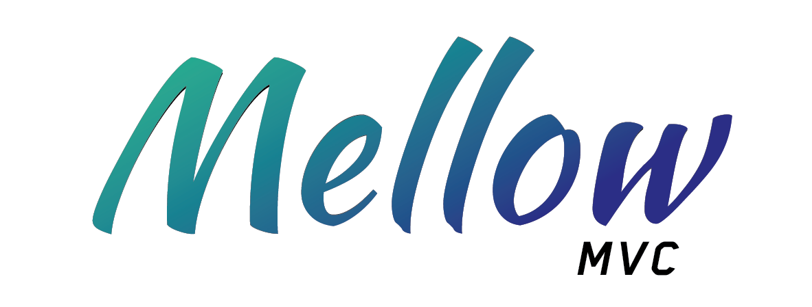

# MellowMVC

A simple PHP framework based on MVC Architecture with a custom SQL Query Builder. 

Developed for the 2nd year group project SCS2202.
Architecture is built following the [course](https://www.udemy.com/course/object-oriented-php-mvc/) by **Brad Traversy**.

## How to use
- Clone the repository to your localhost folder  
  ```
  git clone https://github.com/daredevil25/MellowMVC.git
  ```

- Import the SQL dump file  
  [a link](./public/resources/mellowmvc_db.sql)

- Visit the site  
  http://localhost/MellowMVC/home 
